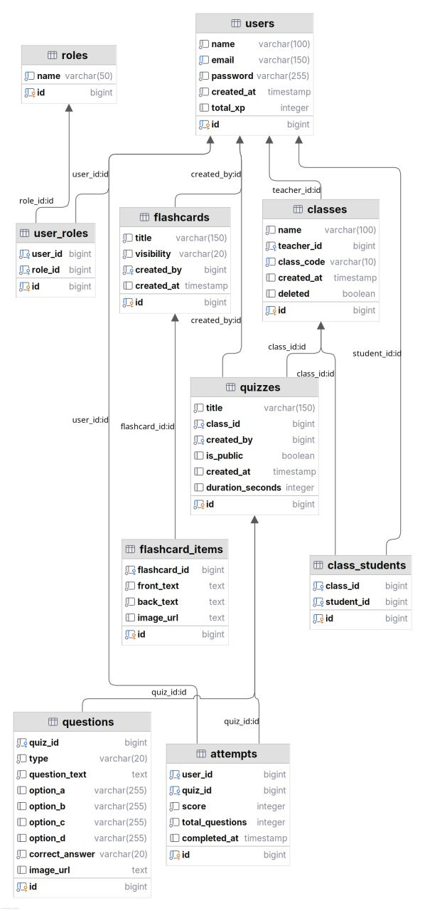

# QUIZERA PROJECT — DATABASE Table

This document describes the database schema design for the Quizera Learning Management System (LMS).

---

# USERS

| Column     | Type        | Notes          |
| ---------- | ----------- | -------------- |
| id         | BIGINT (PK) | Auto increment |
| name       | VARCHAR     | Not null       |
| email      | VARCHAR     | UNIQUE         |
| password   | VARCHAR     | Hashed         |
| created_at | TIMESTAMP   | Auto           |
| total_xp   | INT         | Default 0      |

---

# ROLES

| Column | Type           | Notes  |
| ------ | -------------- | ------ |
| id     | BIGINT (PK)    | Auto   |
| name   | ENUM(UserRole) | UNIQUE |

---

# USER_ROLES (JOIN TABLE)

| Column  | Type          | Notes    |
| ------- | ------------- | -------- |
| id      | BIGINT (PK)   | Auto     |
| user_id | FK → users.id | Not null |
| role_id | FK → roles.id | Not null |

**Constraint:**

* Unique: `(user_id, role_id)`

---

# CLASSROOMS

| Column     | Type          | Notes       |
| ---------- | ------------- | ----------- |
| id         | BIGINT (PK)   | Auto        |
| name       | VARCHAR       | Not null    |
| teacher_id | FK → users.id | Not null    |
| class_code | VARCHAR       | UNIQUE      |
| created_at | TIMESTAMP     | Auto        |
| deleted    | BOOLEAN       | Soft delete |

---

# CLASS_STUDENTS

| Column     | Type               | Notes    |
| ---------- | ------------------ | -------- |
| id         | BIGINT (PK)        | Auto     |
| class_id   | FK → classrooms.id | Not null |
| student_id | FK → users.id      | Not null |

---

# QUIZZES

| Column           | Type               | Notes         |
| ---------------- | ------------------ | ------------- |
| id               | BIGINT (PK)        | Auto          |
| title            | VARCHAR(150)       | Not null      |
| class_id         | FK → classrooms.id | Not null      |
| created_by       | FK → users.id      | Not null      |
| is_public        | BOOLEAN            | Default false |
| created_at       | TIMESTAMP          | Auto          |
| duration_seconds | INT                | Nullable      |

---

# QUESTIONS

| Column         | Type               | Notes    |
| -------------- | ------------------ | -------- |
| id             | BIGINT (PK)        | Auto     |
| quiz_id        | FK → quizzes.id    | Not null |
| type           | ENUM(QuestionType) | Not null |
| question_text  | TEXT               | Not null |
| option_a       | VARCHAR            | MCQ      |
| option_b       | VARCHAR            | MCQ      |
| option_c       | VARCHAR            | MCQ      |
| option_d       | VARCHAR            | MCQ      |
| correct_answer | ENUM(McqOption)    | Not null |
| image_url      | VARCHAR            | Optional |

---

# QUIZ_ATTEMPTS

| Column          | Type            | Notes    |
| --------------- | --------------- | -------- |
| id              | BIGINT (PK)     | Auto     |
| user_id         | FK → users.id   | Not null |
| quiz_id         | FK → quizzes.id | Not null |
| score           | INT             | Not null |
| total_questions | INT             | Not null |
| completed_at    | TIMESTAMP       | Auto     |

---

# FLASHCARDS

| Column     | Type          | Notes            |
| ---------- | ------------- | ---------------- |
| id         | BIGINT (PK)   | Auto             |
| title      | VARCHAR       | Not null         |
| visibility | ENUM          | PUBLIC / PRIVATE |
| created_by | FK → users.id | Not null         |
| created_at | TIMESTAMP     | Auto             |

---

# FLASHCARD_ITEMS

| Column       | Type               | Notes    |
| ------------ | ------------------ | -------- |
| id           | BIGINT (PK)        | Auto     |
| flashcard_id | FK → flashcards.id | Not null |
| front_text   | TEXT               | Not null |
| back_text    | TEXT               | Not null |
| image_url    | VARCHAR            | Optional |

---

# SUMMARY

| Category         | Tables                            |
| ---------------- | --------------------------------- |
| Auth System      | users, roles, user_roles          |
| Classroom System | classrooms, class_students        |
| Quiz System      | quizzes, questions, quiz_attempts |
| Flashcard System | flashcards, flashcard_items       |

---

# ERD 

